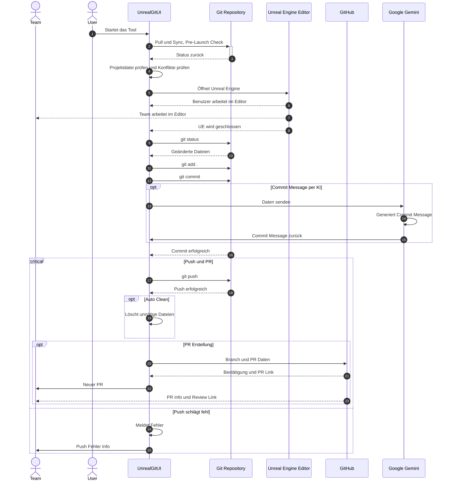

# UnrealGitUI
UnrealGitUI is a graphical user interface (GUI) application designed to facilitate interaction with Git repositories, specifically tailored for Unreal Engine projects. It aims to simplify version control tasks for developers working within the Unreal Engine ecosystem.

## 📋 Tool-Checkliste: Professionelles Developer-Tool (Mini-IDE für Unreal-Git-Workflows)

### I. 🚀 Kern-Workflow & Mechaniken

Die Kernfunktion dreht sich um den **automatisierten Git–→Unreal–→Git–→PR Workflow**.

- [ ] **Unreal Starten & Überwachen:**
    - [ ] Unreal in einem Subprocess starten, ohne das Tool zu blockieren (`Popen`).
    - [ ] Prozess überwachen: Wenn UE geschlossen wird, die nächsten Schritte triggern.
    - [ ] Das Tool bleibt aktiv, während UE geöffnet ist.
    - [ ] Reload-Funktion ermöglichen (UE mehrfach öffnen).
- [ ] **Pre-Launch Checks (Vor dem Öffnen von UE):**
    - [ ] Syncen (Pull).
    - [ ] Check auf Konflikte anzeigen.
    - [ ] Überprüfen, ob Projektdatei existiert und UE Editor Pfad gültig ist.
    - [ ] Optional: Plugin-Aktivitätscheck.
- [ ] **Post-Close Handling (Nach dem Schließen von UE):**
    - [ ] Git Status abfragen und alle Änderungen sammeln.
    - [ ] Alle Änderungen automatisch adden (`repo.git.add(A=True)`).
    - [ ] Automatisches Committen ermöglichen (KI-Text, Timestamp, Pattern oder Benutzer-Input).
    - [ ] Am Ende alles pushen.
    - [ ] Optional: Auto Clean (löscht unnötige Dateien).

### II. 🔗 GitHub & PR-Integration (Vollautomatisiert & Flexibel)

- [ ] **GitHub Authentifizierung:**
    - [ ] Option A: GitHub API Token (gespeichert in `settings.json`, verschlüsselt).
    - [ ] Option B: GitHub CLI (`gh`), wenn installiert.
- [ ] **PR-Erstellung (Pull Request):**
    - [ ] Auto-PR Branch detection.
    - [ ] Template-Support (konfigurierbar über Settings Tab).
    - [ ] Möglichkeit, Labels auszuwählen.
    - [ ] Möglichkeit, Reviewer hinzuzufügen.
    - [ ] Milestones (optional).
    - [ ] Wahl der Methode: PyGithub oder GitHub CLI (`gh pr create`).
- [ ] **PR Preview:**
    - [ ] Diff Summary abrufbar.
    - [ ] Anzeige der Anzahl Dateien.
    - [ ] Anklickbare Datei-Liste.
    - [ ] Filesize warnings.
- [ ] **CI/CD & Status:**
    - [ ] Anzeigen von GitHub Actions Status.
    - [ ] Build/CI Status für die aktuelle Branch anzeigen.
    - [ ] Webhooks Integration (z.B. "Notify Discord" oder "Send Telegram Message", wenn PR erstellt).

### III. ✨ QOL & Power-Features

- [ ] **Automatisierung:**
    - [ ] **Automatische Branch-Generierung** (z.B. `alex/ue-update/2025-11-16` oder `feature/alex-auto-generated-`).
    - [ ] **Auto-Commit Message Vorschläge** (Lokale Heuristik oder GitHub Copilot API).
    - [ ] **Auto-LFS Handling:**
        - [ ] Warnung anzeigen, wenn große Assets hinzugefügt werden.
        - [ ] Automatisch `git lfs track '*.uasset'` ausführen.
        - [ ] LFS Quota anzeigen (via GitHub API).
- [ ] **Inspektion & Sicherheit:**
    - [ ] **Unreal File Change Inspector:** Änderungen in Kategorien sortieren (Blueprints, Materials, C++, Config, Plugins, Maps).
    - [ ] Selektives Committen ermöglichen.
    - [ ] "Safe Commit Mode" (Warnung, wenn mehr als X Dateien geändert oder kritische Ordner betroffen sind).
    - [ ] Snapshot/Backup (ZIP oder Git Stash) vor dem Pull oder UE-Öffnen.
- [ ] **Deep Features:**
    - [ ] **Parallel Repo Support** (Liste aller Projekte / schnell switchen).
    - [ ] **UE Build Automation Buttons** ("Build Game", "Build Editor", "Build Shader Cache").
    - [ ] **Plugin Manager Tab** (Toggle-Funktion für aktivierte Plugins).
    - [ ] **Unreal Profiling Hooks** (Start UE mit Memory/Performance/GPU Profiling Flags).
    - [ ] Auto-Rebase w/ Protection (Verhindern von versehentlichem Pushen eines Konflikt-States).

### IV. 🖥️ UI-Konzept & Terminal

Das UI soll ein Fenster mit Sidebar Tabs und einer Terminal-Konsole unten verwenden.

- [ ] **UI Struktur:** Side Navigation Bar (Sidebar Tabs links).
- [ ] **Tabs Implementierung:**
    - [ ] Dashboard (Startseite, Statusanzeige, Konfliktindikator).
    - [ ] Workflow (Wizard mit anklickbaren Steps).
    - [ ] Git Tools (Manuelle Werkzeuge wie Branch wechseln, Stash, Cleanup).
    - [ ] Unreal Tools (Projekt öffnen, temporäre Dateien löschen).
    - [ ] Terminal.
    - [ ] Settings.
- [ ] **Workflow Tab Features:**
    - [ ] Multi-Step Cards für jeden Schritt.
    - [ ] Statusanzeige pro Step (Running, Done, Failed, Pending).
    - [ ] Live Log-Ausgabe pro Step.
    - [ ] Duration Timer.
- [ ] **Eingebautes Developer Terminal:**
    - [ ] Kein Wechsel zu PowerShell / Git Bash nötig.
    - [ ] Live Output im Textfeld (scrollbar, farblich markiert).
    - [ ] Tabs für mehrere Terminals.
    - [ ] Presets für häufige Befehle (z.B. `git status`, `uebuild`).
    - [ ] Bonus: "Pinned Commands" als Buttons speichern.

### V. ⚙️ Architektur & Tooling

- [ ] **Modularisierung:**
    - [ ] Klare Trennung der Module (z.B. `/ui`, `/core/git`, `/core/unreal`, `/core/config`).
- [ ] **Einstellungen und Konfiguration:**
    - [ ] Konfigurationsdatei (`settings.json`).
    - [ ] Speichern von Repo-Pfad, Unreal Pfad, Default Branch, GitHub Token.
    - [ ] Option, Auto Commit / Auto PR zu aktivieren/deaktivieren.
- [ ] **Portabilität (Optional):**
    - [ ] Tool kompilieren (PyInstaller, Nuitka, oder Briefcase für GUI-native Bundles).
    - [ ] Portabler `settings.json` Ordner.
    - [ ] Portable GitHub Token Speicherung.

# Google NotebookLM
